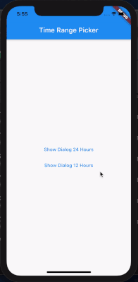

# flutter_time_range

A flutter widget that allowing users to choose time range (from - to) 

## Showcase




## Example
(See example for more detail)

```dart
  @override
  Widget build(BuildContext context) {
    return MaterialApp(
        navigatorKey: _navigatorKey,
        scaffoldMessengerKey: _messangerKey,
        title: 'Test Time Range Picker',
        home: Scaffold(
          appBar: AppBar(
            title: Text("Time Range Picker"),
          ),
          body: TextButton(
            child: Text("Show Dialog"),
            onPressed: () {
              showTimeRangePicker(_navigatorKey.currentState.overlay.context);
            },
          ),
        ));
  }

  Future<void> showTimeRangePicker(BuildContext context) {
    return showDialog(
        context: context,
        builder: (BuildContext context) {
          return AlertDialog(
            title: Text("Choose event time"),
            content: TimeRangePicker(
              backText: "Back",
              nextText: "Next",
              cancelText: "Cancel",
              selectText: "Select",
              onSelect: (from, to) {
                _messangerKey.currentState.showSnackBar(
                    SnackBar(content: Text("From : $from, To : $to")));
                Navigator.pop(context);
              },
              onCancel: () => Navigator.pop(context),
            ),
          );
        });
  }
```

## TODOS

* Support 12 hour format